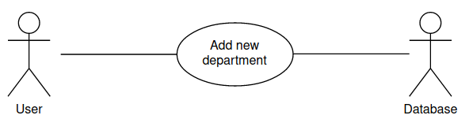

1. **Purpose**
    1. *Definitions*
        Term | Definition
        ---- | ---- 
        Database | Collection of all the information monitored by this system.
        User | Person who interacts wuth web service.
        Admin/Administrator | Person who is managing and controlling the system
        UI | User Interface, visual representations of functional

    2. *Background*  
It was necessary to create a web application that would allow controlling the data about departments and employees in one application. The purpose of this document is to give a detailed description of the Web Administration System "DepBoard". It will illustrate the purpose and complete declaration for the development of system. It will also explain system constraints, interface and how the system will react to external influence. This document is intended to be proposed to a customer for its approval and as a reference for developing for the development team.
    3. *System overview*  
The "DepBoard" is a web service which helps administrator manage the data about company. The system contains information about departments and employees, allow to change existing data or add new one. Filtration of workers by date of birth is also provided. All this information stored in the relational database.
    4. *References*  
IEEE. IEEE Std 830-1998 IEEE Recommended Practice for Software Requirements Specifications. IEEE Computer Society, 1998.
        
2. **Overall description**
    1. *Product perspective*
         
         The Web Administration System has three active actors and three cooperating system. The User/Admin or External Service accesses the "DepBoard" through the Nginx, which redirects request to Gunicorn. Gunicorn, in turn, refers to the application itself. 
        Since this is a data-centric product it will need somewhere to store the data. For that, a Database will be used. Web application accesses to Database in order to add, remove or fetch the data and return it to User or External Service, however in slightly different ways. User gets information via user interface, in tables. External Service sends requests to add, remove or get data and recieves answers in JSON format.
    2. *Product functions*
        With the web application, the users will be able to search for information about departments and employees in it. The result presented in tables filled with data and links to more specific information about chosen row. When following this link user can look through data and manipulate with it. The update button allows change fields about an existing department or person. The delete button deletes chosen row from database. If user trying to delete department which has employees, all employees will be removed too. In order to prevent accidental deletion, the warning window will appear. 
        The employees page provide searching by birthday. The result of the search will be viewed either as a table or as a no-result message.
    3. *User characteristics*   
        There is one type of users that interacts with web application and they can only use web service for managing company data.
    4. *Constraints, assumptions and dependencies*
        The Internet connection is a constraint for the application because it is a web service. If user wants to us UI, then he/she must have installed web browser. Also, the interface will most likely not be the same for on monitors of different resolutions. For correct working, user should enable javascript in the web browser.
3. **Specific requirements**
    1. External interface requirements
        ! - User Interfaces 
        - Hardware Interfaces 
            Since the web application does not have any designated hardware, it does not have any direct hardware interfaces. The hardware connection to the database server is managed by the underlying operating system on the mobile phone and the web server.
        - Software Interfaces 
            As WSGI server application uses Gunicorn. The folder 'department-app' contains file 'wsgi.py' which is involved in runing WSGI server and config file in the root of project folder. To run Gunicorn needs to install 'pip gunicorn' and enter following command into terminal: 
            '''bash
            gunicorn -c gunicorn_config.py "department-app.wsgi:create_app()"
            '''
        - Communication Interfaces 
            The communication between the database and the application is implemented using the SQLAlchemy module in the program code.
    2. Functional requirements
        This section includes the requirements that specify all the fundamental actions of the system.
        - User Class 1 - The User
            **Use case:** Get list of employees 
            **Diagram** 
            **Brief description** 
            The User accesses the web service and gets web page with list of existing employees that is stored in database.  
            **Use case:** Get list of departments 
            **Diagram** 
            **Brief description** 
            The User accesses the web service and gets list of existing departments that stores in database via UI.  
            **Use case:** Get certain employee 
            **Diagram** 
            **Brief description** 
            The User gets list of existing employees and selects certain employee. After click appears page with information about selected worker.  
            **Use case:** Get certain department 
            **Diagram** 
            **Brief description** 
            The User gets list of existing departments and selects certain department. After click appears page with information about selected department.  
            **Use case:** Add new employee 
            **Diagram** 
            **Brief description** 
            The User clicks "Add employee" button and fills fields with data. After this new employee is saved in database. If a required fields are not filled in, the User cannot complete the case.  
            **Use case:** Add new department 
            **Diagram** 
            **Brief description** 
            The User clicks "Add department" button and fills fields with data. After this new department is saved in database.  
            **Use case:** Add existing department 
            **Diagram** 
            **Brief description** 
            The User clicks "Add department" button and fills fields with data but department name already exists in database. User gets form again with error message.  
            **Use case:** Update existing employee 
            **Diagram** 
            **Brief description** 
            The User clicks update button and change fields. After this data is saved in database. If a required fields are not filled in, the User cannot complete the case.  
            **Use case:** Update existing department 
            **Diagram** 
            **Brief description** 
            The User clicks update button and change fields. After this data is saved in database.  
            **Use case:** Update department to existing name 
            **Diagram** 
            **Brief description** 
            The User clicks update button and change fields but new department name already exists in database. User gets form again with error message.  
            **Use case:** Delete employee 
            **Diagram** 
            **Brief description** 
            The User clicks delete button. Employee is removed from database.  
            **Use case:** Delete department 
            **Diagram** 
            **Brief description** 
            The User clicks delete button. Department is removed from database if has no employees. Otherwise, a warning window is displayed and the User can cancel the deletion.  
            **Use case:** Filter employee by birthday 
            **Diagram** 
            **Brief description** 
            The User choose two dates and system gives out list of employees with birthday in this period.  
        - User Class 2 - The External Service
            **Use case:** Get list of employees 
            **Diagram** 
            **Brief description** 
            The External Service accesses the web service via url '/api/employees' and gets JSON with list of existing employees that stores database.  
            **Use case:** Get list of departments 
            **Diagram** 
            **Brief description** 
            The External Service accesses the web service via url '/api/departments' and gets list of existing departments that stores in database in JSON format.  
            **Use case:** Get certain employee 
            **Diagram** 
            **Brief description** 
            The External Service gets certain employee via url '/api/employees/*id*'.  
            **Use case:** Get certain department 
            **Diagram** 
            **Brief description** 
            The External Service gets certain employee via url '/api/departments/*id*'.  
            **Use case:** Add new employee 
            **Diagram** 
            **Brief description** 
            The External Service sends JSON with data in order to add new employee. After this employee is saved in database.  
            **Use case:** Add new department 
            **Diagram** 
            **Brief description** 
            The External Service sends JSON with data in order to add new department. After this department is saved in database.  
            **Use case:** Update existing employee 
            **Diagram** 
            **Brief description** 
            The External Service sends JSON with data in order to update existing employee. After this data is saved in database.  
            **Use case:** Update existing department 
            **Diagram** 
            **Brief description** 
            The External Service sends JSON with data in order to update existing department. After this data is saved in database.  
            **Use case:** Delete certain employee 
            **Diagram** 
            **Brief description** 
            The External Service deletes certain employee via url '/api/employees/*id*' with DELETE method. Employee is removed from database.  
            **Use case:** Delete certain department 
            **Diagram** 
            **Brief description** 
            The External Service deletes certain department via url '/api/departments/*id*' with DELETE method. Department is removed from database.  
            **Use case:** Delete all list of employees 
            **Diagram** 
            **Brief description** 
            The External Service deletes all employees via url '/api/employees' with DELETE method. Table "employees" is empty.  
            **Use case:** Send invalid JSON or dend requests to wrong URL 
            **Diagram** 
            **Brief description** 
            The External Service sends HTTP requests to invalid URLs or sends JSON with wrong structure. Web service can't manage such cases and return error message with appropriate status code.  
    3. Logical database requirement
        All the data shall be stored in relational database, in this case, in MySQL. For each department, ID, name (unique), average salary in department, amount of employees, email address (optional) shall be stored in one table. For each employee, ID, name, birthday (yyyy-mm-dd), department id, salary and date since working (optional and format 'yyyy-mm-dd') shall be stored in table as well. 
        *Note: the file format and type may vary when the system is being developed. 
        
        
